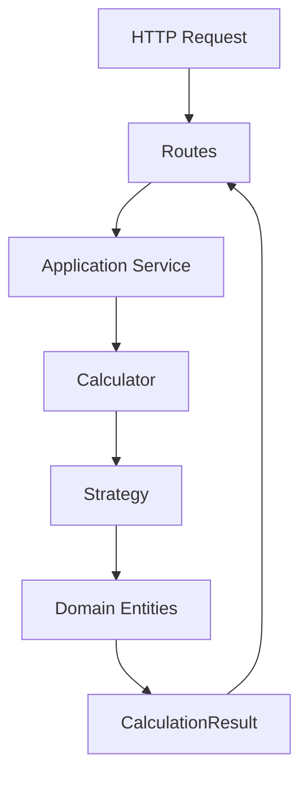
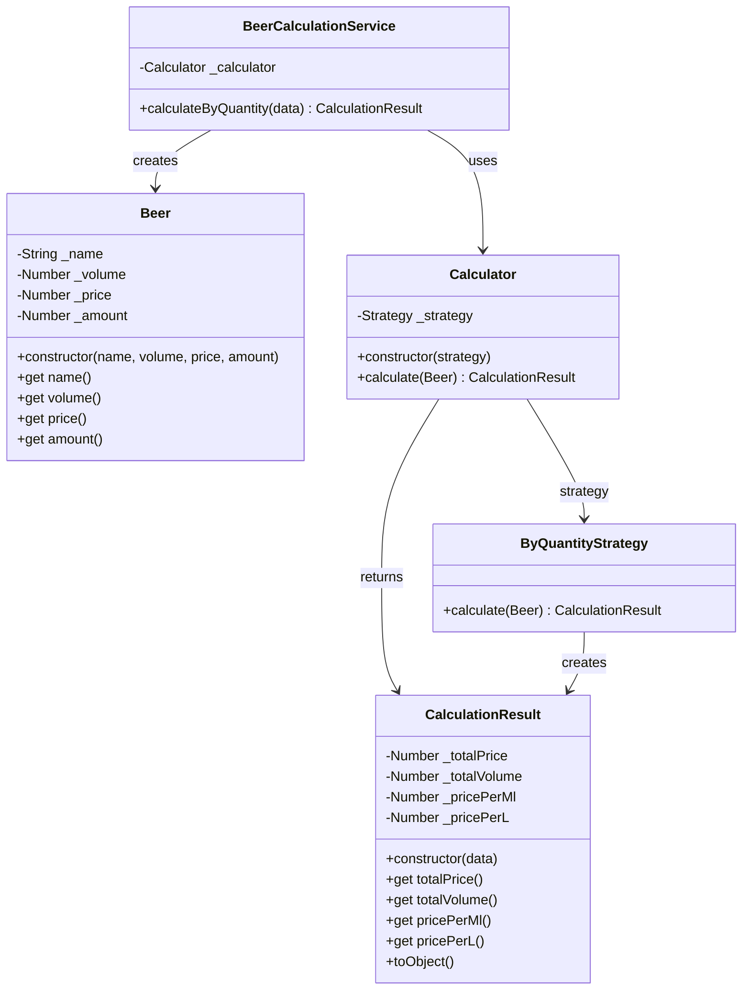

 
[](https://)

# 🍺 Beer Calculator API

API básica para cálculo comparativo de preços de cerveja com base em quantidade e volume, aplicando **boas práticas de arquitetura em camadas**, **Domain-Driven Design (DDD)** e **Strategy Pattern**.

Este projeto foi criado com foco em **clareza arquitetural**, **baixo acoplamento** e **facilidade de evolução**, servindo tanto como estudo quanto como material de portfólio.

---

## 🎯 Objetivo

Permitir o cálculo de:

* Preço total da compra
* Volume total adquirido
* Preço por mililitro
* Preço por litro

A partir de dados simples de uma cerveja, mantendo as regras de negócio isoladas do framework web.

---

## 🧱 Arquitetura em Camadas

O projeto segue uma separação clara de responsabilidades:

```
src
├── application
│   └── BeerCalculationService.js
│
├── domain
│   ├── Beer.js
│   ├── Calculator.js
│   └── CalculationResult.js
│
├── strategies
│   └── ByQuantityStrategy.js
│
├── routes
│   └── beer.routes.js
│
└── server.js
```

### 📌 Responsabilidades

| Camada          | Responsabilidade                      |
| --------------- | ------------------------------------- |
| **Domain**      | Regras de negócio puras e entidades   |
| **Strategies**  | Algoritmos de cálculo intercambiáveis |
| **Application** | Orquestração de casos de uso          |
| **Routes**      | Entrada HTTP (Express)                |

---

## 🧠 Diagrama de Arquitetura (Camadas)



---

## 🧩 Diagrama de Classes



---

## 🔁 Strategy Pattern

O cálculo é desacoplado através do **Strategy Pattern**, permitindo adicionar novos critérios sem alterar o fluxo principal.

Exemplos futuros:

* `ByVolumeStrategy`
* `ByPackageStrategy`
* `BestCostBenefitStrategy`

---

## 🚀 Endpoint

### `POST /beer/calculate/quantity`

#### Body

```json
{
  "name": "IPA",
  "volume": 350,
  "price": 7.5,
  "amount": 6
}
```

#### Response

```json
{
  "totalPrice": 45,
  "totalVolume": 2100,
  "pricePerMl": 0.02,
  "pricePerL": 21.43
}
```

---

## 🧪 Regras de Negócio

* Todos os valores devem ser **numéricos e positivos**
* O arredondamento é responsabilidade do **domínio**, não da rota
* O preço por ml é normalizado para facilitar comparação prática

---

## 🛠️ Tecnologias

* Node.js
* Express
* JavaScript (ES6+)
* Mermaid (diagramas no GitHub)

---

## 📈 Evoluções Futuras

* Novas strategies de cálculo
* Comparação entre múltiplas cervejas
* Persistência de histórico
* Testes unitários por camada

---
